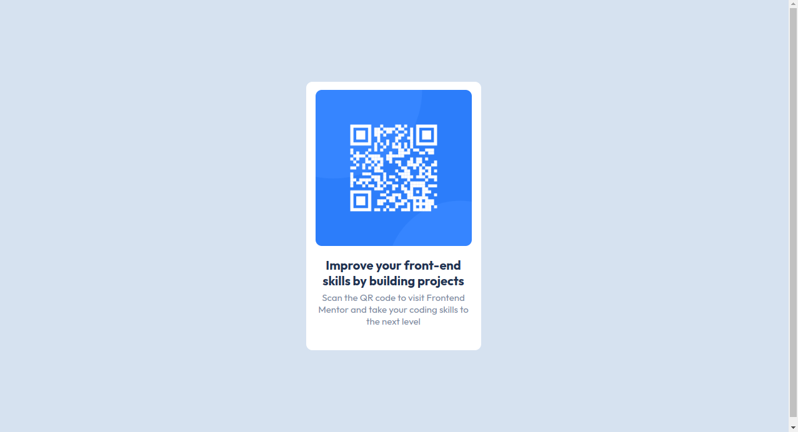

# Frontend Mentor - QR code component solution

## Table of contents

- [Overview](#overview)
  - [Screenshot](#screenshot)
  - [Links](#links)
  - [Built with](#built-with)

## Overview

The QR code component challenge on Frontend Mentor provided an opportunity to enhance my coding skills by creating a functional QR code display within a web page. The challenge focused on using HTML and CSS to build a visually appealing and responsive component.

### Screenshot

### Built with

- Flexbox
